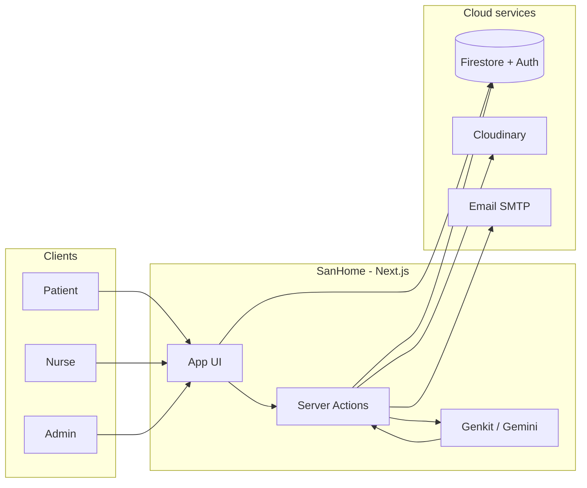

 
| **Nurse** | Patient roster, visit tracking, vitals & treatments, geolocation-aware workflows |
| **Admin** | Oversight dashboard, data tools, and platform-wide visibility |
---
## Feature highlights
- **Secure auth** — Firebase Authentication with role-based access (patient / nurse / admin)
- **Patient profiles** — Demographics, mobility status, pathologies, and care context
- **Nurse management** — Profiles and location-aware coordination for field care
- **Appointments** — Book, view, and manage visits end to end
- **Care tracking** — Vitals, treatments, and follow-up logs over time
- **Medical files** — History, conditions, medications, and visit records in one place
- **Notifications** — Reminders and treatment alerts
- **Real-time chat** — Direct messaging between nurses and patients
- **Video consult** — Secure in-browser consultations with shareable room links
- **Dashboard analytics** — Role-specific insights on activity and care quality
- **Personalized care suggestions** — AI-powered recommendations (Gemini via Genkit) that respect mobility and clinical context
- **Document exports** — PDF generation for reports and summaries
- **Media uploads** — Cloudinary-backed file handling where configured
---
## Tech stack
| Layer | Tools |
|-------|--------|
| **App** | [Next.js 15](https://nextjs.org/) (App Router, Turbopack) · [React 18](https://react.dev/) · [TypeScript](https://www.typescriptlang.org/) |
| **UI** | [Tailwind CSS](https://tailwindcss.com/) · [Radix UI](https://www.radix-ui.com/) · [Recharts](https://recharts.org/) |
| **Backend & data** | [Firebase](https://firebase.google.com/) (Auth, Firestore, Analytics) |
| **AI** | [Genkit](https://firebase.google.com/docs/genkit) · Google AI (Gemini) |
| **Integrations** | Cloudinary · Nodemailer |
---
## Architecture at a glance

---
## Getting started
### Prerequisites
- **Node.js 18+**
- A **Firebase** project with Authentication (Email/Password) and **Cloud Firestore** enabled
- Optional: Cloudinary account, Gmail app password (or other SMTP) for email features
### Install & run
```bash
git clone https://github.com/nourhb/sanhome.git
cd sanhome
npm install
```
Create **`.env.local`** in the project root (never commit this file):
```env
# Firebase (required)
NEXT_PUBLIC_FIREBASE_API_KEY=
NEXT_PUBLIC_FIREBASE_AUTH_DOMAIN=
NEXT_PUBLIC_FIREBASE_PROJECT_ID=
NEXT_PUBLIC_FIREBASE_STORAGE_BUCKET=
NEXT_PUBLIC_FIREBASE_MESSAGING_SENDER_ID=
NEXT_PUBLIC_FIREBASE_APP_ID=
NEXT_PUBLIC_FIREBASE_MEASUREMENT_ID=
NEXT_PUBLIC_USE_FIREBASE_EMULATORS=false
NEXT_PUBLIC_APP_URL=http://localhost:9002
# Optional — file uploads
CLOUDINARY_CLOUD_NAME=
CLOUDINARY_API_KEY=
CLOUDINARY_API_SECRET=
# Optional — transactional email
EMAIL_USER=
EMAIL_PASS=
```
Start the dev server:
```bash
npm run dev
```
Open **[http://localhost:9002](http://localhost:9002)**.
### Other scripts
| Command | Description |
|---------|-------------|
| `npm run build` | Production build |
| `npm run start` | Run production server |
| `npm run lint` | ESLint |
| `npm run typecheck` | TypeScript check |
| `npm run genkit:dev` | Genkit developer UI for AI flows |
---
## Design language
SanHome follows a deliberate, accessible palette:
- **Primary** — Soft green `#A5D6A7` (health, calm)
- **Secondary** — Light blue `#BBDEFB` (trust)
- **Accent** — Warm yellow `#FFEB3B` (calls to action)
Typography stays clean and readable; navigation uses consistent iconography and subtle motion so the app feels alive without getting noisy.
---
## Project layout (quick map)
```
src/
  app/           # Routes, layouts, server actions
  components/    # UI and feature components
  contexts/      # Auth and shared React context
  ai/            # Genkit flows (e.g. personalized care)
  lib/           # Firebase client, utilities, constants
docs/
  blueprint.md   # Product blueprint & feature spec
```
---
## Security note
Environment files (`.env`, `.env.local`, etc.) are **gitignored** on purpose. Rotate any credentials that were ever shared in chat or committed by mistake, and use Firebase security rules (`firestore.rules`) to lock down production data.
---
## License
Private project — see repository owner for usage terms.
---
<p align="center">
  <strong>SanHome</strong> — coordinated home care, one dashboard at a time.
</p>


